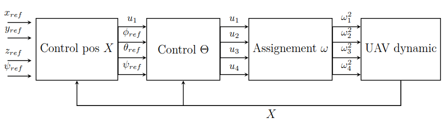
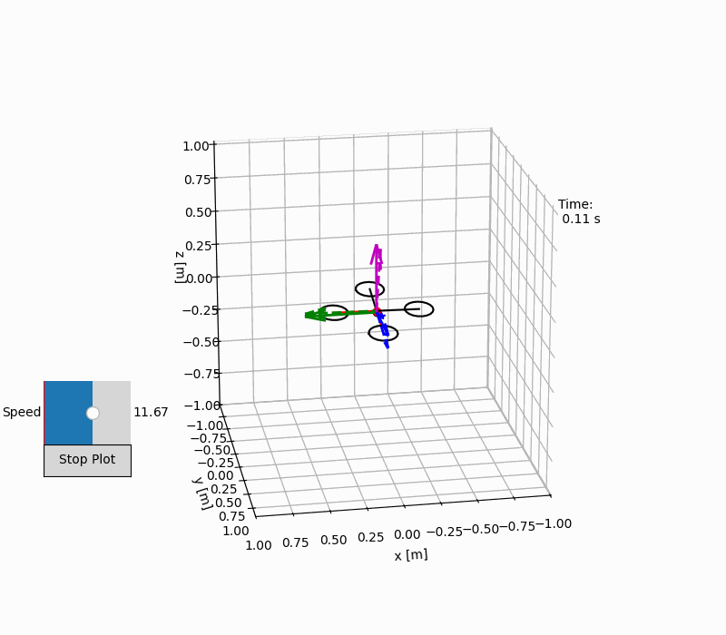
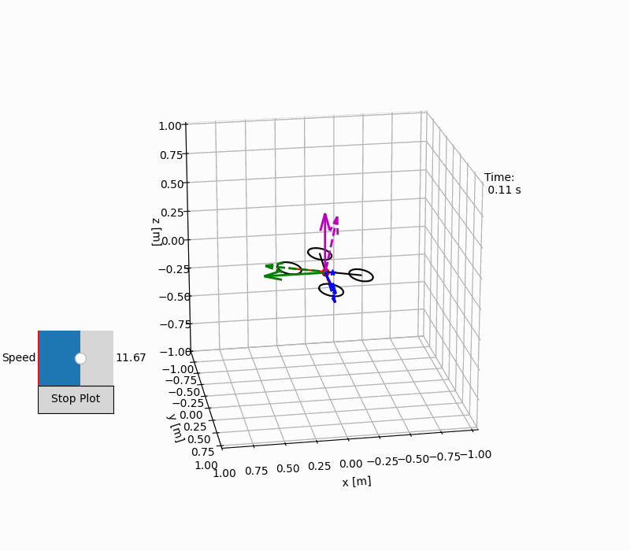
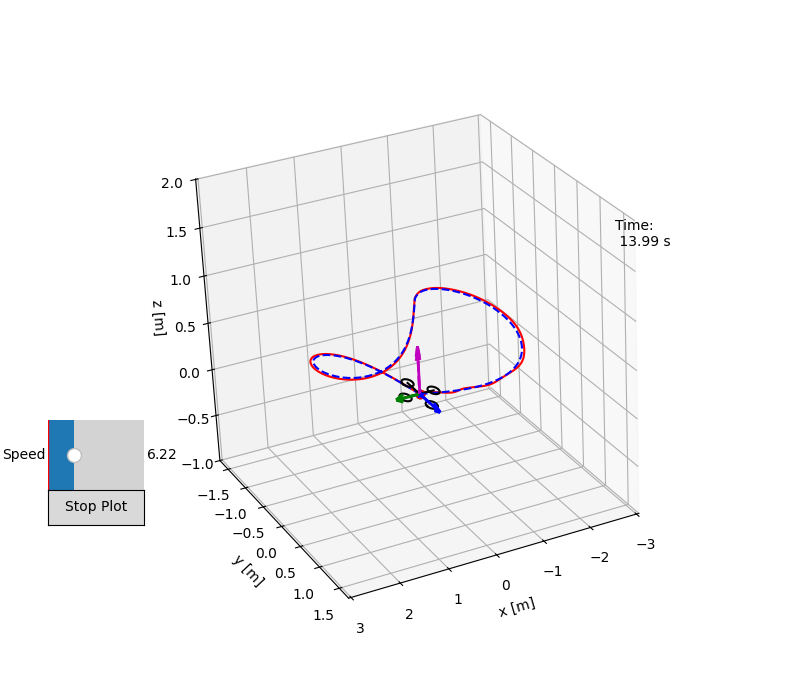

# Quadcopter-control-Python

 
 

## 📝 Description
This project aims to develop a simple simulation model of a quadcopter UAV with its graphic visualization in Python. Moreover, it implements different controllers for tracking several types of 3D reference trajectories. It also includes visualization of the flight data, and controller performances. 

## 📌 Controllers Implemented:
- Feedback linearization
- Sliding Mode Control (SMC)

## System dynamic

The quadrotor is modeled using the full 6-DOF Newton–Euler equations (second law of Newton and Euler’s rotation equations), including nonlinear couplings, gyroscopic moments, and cross-inertia effects. 

## Control loop scheme

 </img>

## 📈 Visualize Results

- Tracking helicoidal trajectory using SMC:
  
 </img>

- Tracking Bernoulli lemniscate type trajectory using SMC:
  
 </img>

<!--   </img>-->

## How to use it

1. Run the main script `quadcopter_main.py` on your favorite Python interpreter.

## 🤝 Contributing

Contributions are welcome!

Future improvements could include:
- MPC implementation
- Better controller tuning
- More detailled Readme
- Monte Carlo simulation
---

## 📚 References  
- ["Model Based Control of Quadcopters", Spring Semester 2015-2016, MT Master Project EPFL, Martí POMÉS ARNAU](https://upcommons.upc.edu/server/api/core/bitstreams/b03e2a1f-d047-45d4-8b43-941f029e6729/content)  
